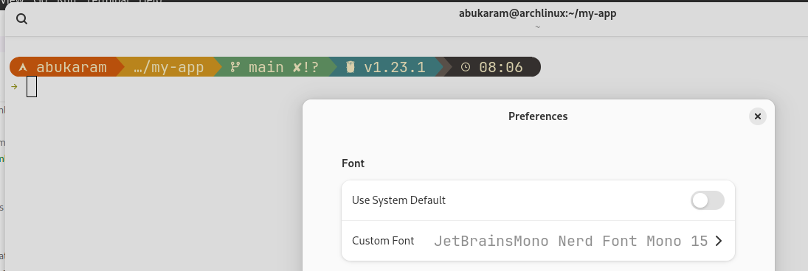

my app

Note: Terminal used with:

sudo pacman -S starship // https://starship.rs/
// https://starship.rs/presets/gruvbox-rainbow
// $ starship preset gruvbox-rainbow -o ~/.config/starship.toml

font used at terminal: 

At VS code, View -> Command Pallet -> Preferences: Open User Settings (JSON) 

{
    "workbench.colorTheme": "Quiet Light",
    "workbench.preferredHighContrastColorTheme": "Quiet Light",
    "terminal.integrated.fontSize": 16,
    "terminal.integrated.fontFamily": "FiraCode Nerd Font Mono",
    "editor.fontFamily": "JetBrains Mono", // Font Family
    "editor.fontSize": 18, // Font Size
    //"editor.fontWeight": "bold", // Font Weight
    "editor.fontLigatures": true,
    "git.autofetch": true, // Font ligatures
}
